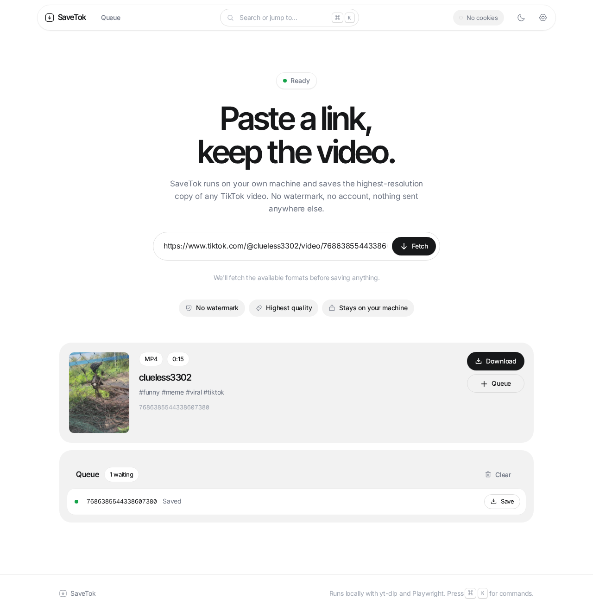
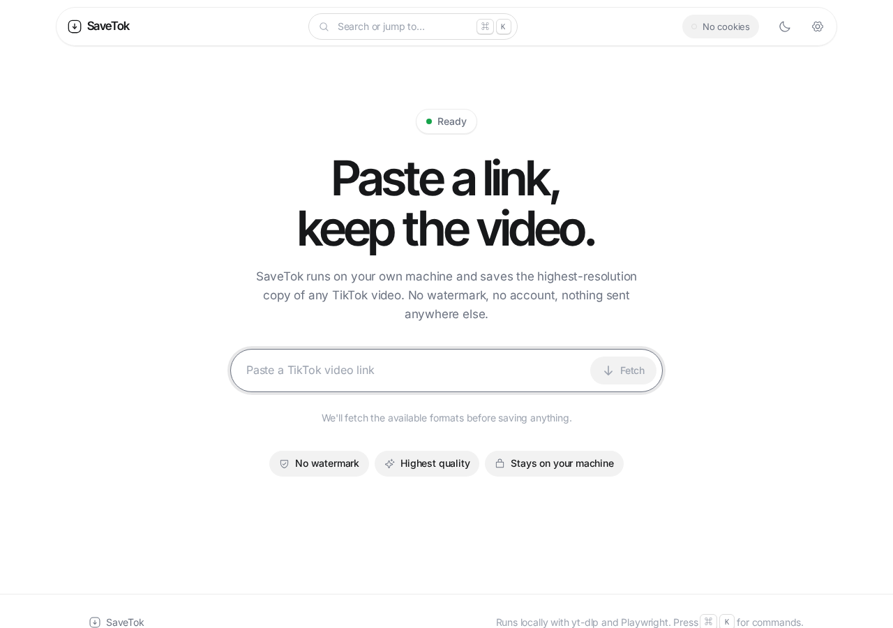
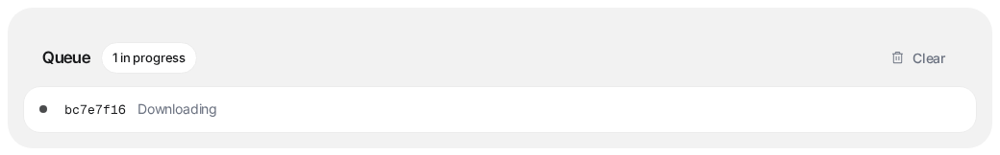
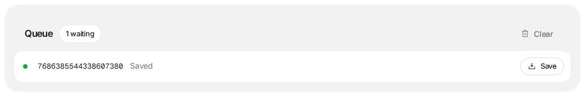
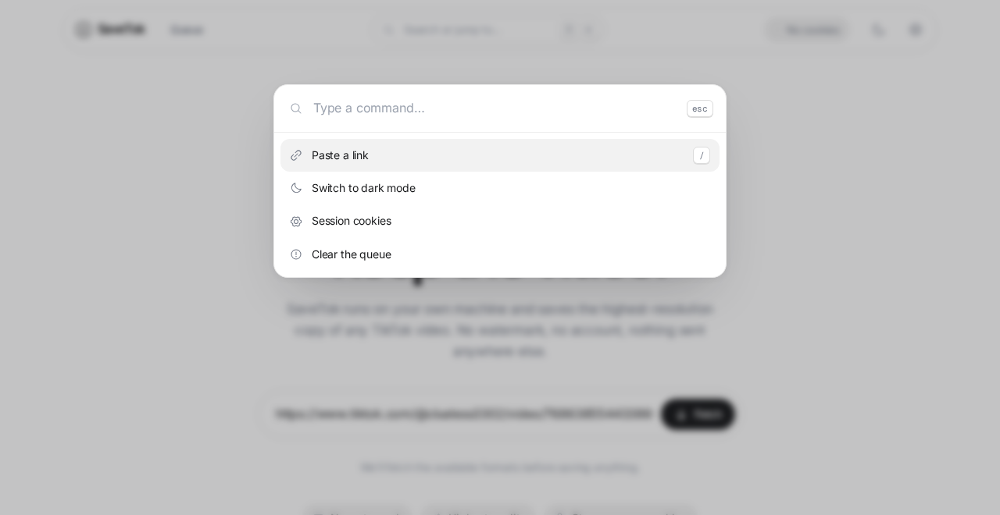
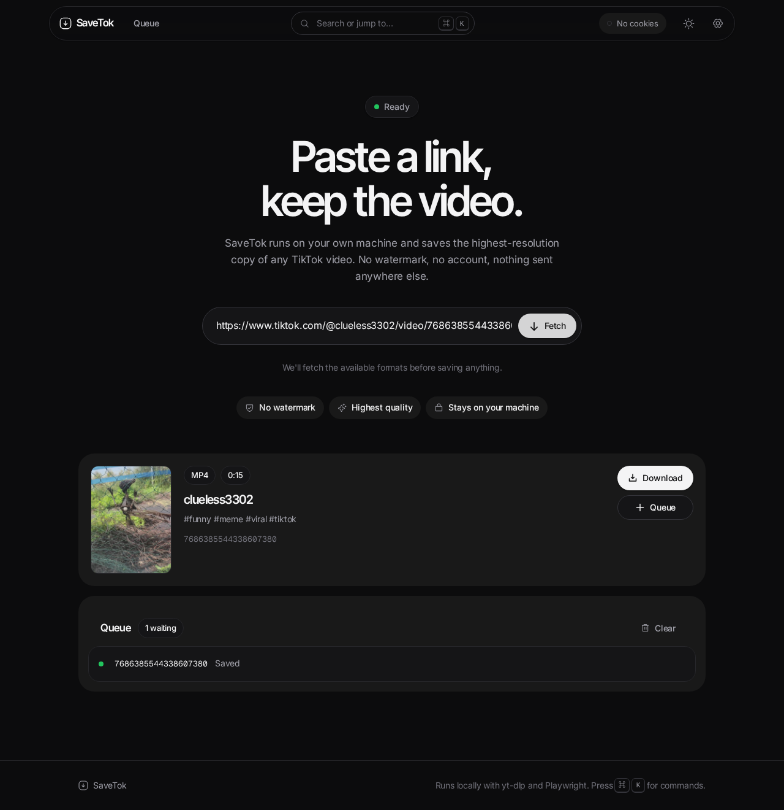
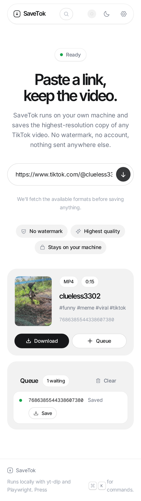
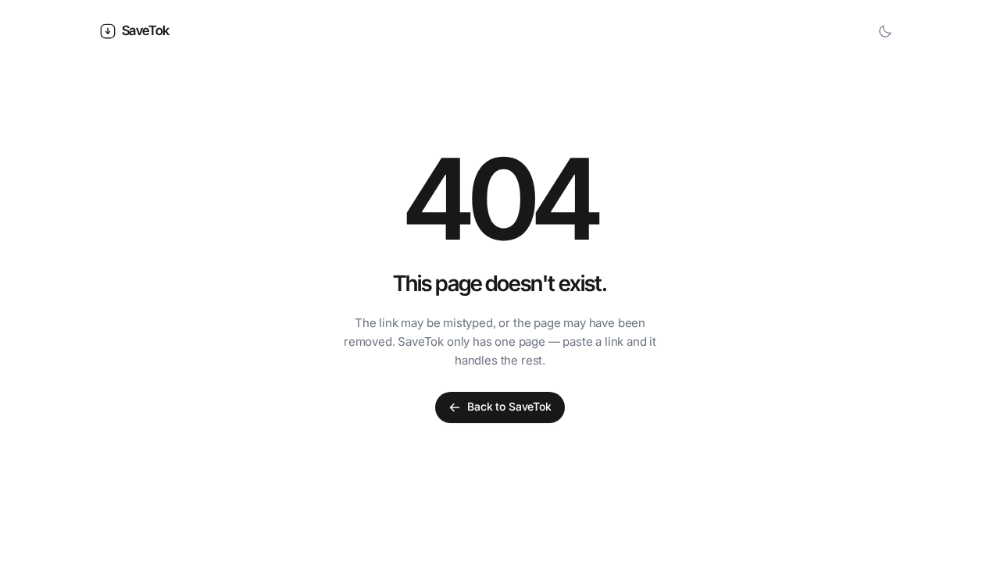

# SaveTok

**Paste a link, keep the video.** A self-hosted TikTok downloader — one page, a download queue, no accounts and no third-party service in the middle.



---

## What it does

- **Paste any TikTok video URL** and get the highest-resolution copy that isn't the watermarked one.
- **Queue several downloads** — a background worker works through them and keeps the finished files until you collect them.
- **Proxies the bytes.** TikTok's CDN links are signed, short-lived and header-sensitive, so the server fetches the video and streams it to you. The browser never sees a CDN URL.
- **Falls back to a real browser.** If yt-dlp is blocked, a headless Chromium reads the page instead, and its session cookies are carried over to the download.
- **Optional cookie file** for videos that need a signed-in session.
- **⌘K command palette**, dark mode, fully responsive, keyboard accessible.

## Screenshots

| Landing | Queue while a download runs |
|---|---|
|  |  |

| Finished queue | Command palette |
|---|---|
|  |  |

| Dark mode | Mobile |
|---|---|
|  |  |



## Quick start

### Docker (recommended)

```bash
git clone https://github.com/uzuw/tiktok.git
cd tiktok

cat > .env <<'EOF'
SAVETOK_PORT=8080
SAVETOK_PASSWORD=change-me
EOF

docker compose up -d
```

Open <http://localhost:8080>. The image bundles Chromium and ffmpeg, so nothing else is needed.

> **Set `SAVETOK_PASSWORD`.** With it unset the app is open to anyone who can reach the port — including `/queue` and `/download`.

### From source

Requires **Python 3.11+**, **ffmpeg**, and (for UI changes) **Node 20+**.

```bash
python -m venv .venv && . .venv/bin/activate
pip install -r requirements.txt
playwright install --with-deps chromium     # headless fallback

# The built UI is committed, so this is only needed after changing frontend/
cd frontend && npm ci && npm run build && cd ..

uvicorn app.main:app --host 0.0.0.0 --port 8080
```

## Configuration

| Variable | Default | Meaning |
|---|---|---|
| `SAVETOK_PASSWORD` | _unset_ | Enables HTTP Basic auth. Unset disables the gate entirely. |
| `SAVETOK_PORT` | `8080` | Host port published by Docker Compose. |
| `SAVETOK_RATE_LIMIT` | `240` | Inbound requests per minute per IP. Static assets are not counted. |
| `SAVETOK_OUTBOUND_RPS` | `1` | Outbound TikTok requests per second. See the note below. |
| `SAVETOK_OUTBOUND_BURST` | `3` | Allowance above the steady outbound rate. |
| `SAVETOK_TRUST_PROXY` | _unset_ | Honour `X-Forwarded-For`. Only set this behind a reverse proxy you control. |
| `TZ` | `UTC` | Container timezone. |

**On `SAVETOK_OUTBOUND_RPS`:** this is a limiter, and it is deliberately the latency knob. TikTok blocks aggressive clients quickly, so requests are spaced out by default. Raising it makes resolves faster and increases the chance of your IP being blocked.

## API

All endpoints are same-origin and reachable by the bundled UI.

| Method | Path | Purpose |
|---|---|---|
| `POST` | `/resolve` | `{ "url": ... }` → metadata + the chosen `format_id` |
| `GET` | `/download?url=&format_id=` | Streams the video as an attachment |
| `POST` | `/queue` | `{ "url": ..., "format_id": ... }` → queue item |
| `GET` | `/queue` | All queue items |
| `GET` | `/queue/{id}` | One item's status |
| `GET` | `/queue/{id}/file` | The finished file, once completed |
| `DELETE` | `/queue/{id}` | Remove one item |
| `DELETE` | `/queue` | Clear the queue |
| `GET` `POST` `DELETE` | `/auth/cookies` | Cookie file status / upload / remove |

Unknown page paths return the app shell with a real `404`; unknown `/api`-style paths return JSON.

## How it works

```
Browser ──▶ FastAPI ──▶ yt-dlp ─────────▶ TikTok
              │            └─▶ Playwright (fallback)
              │
              └─▶ queue worker ──▶ SQLite + files on disk
```

`/resolve` tries yt-dlp first. If TikTok blocks it, a headless Chromium loads the page, the item data is read out of the page (or its internal API), and the session cookies are harvested so the media request that follows is authorised.

The queue is a single worker thread over SQLite. It is intentionally not Redis: this is a single-user tool. `enqueue` wakes the worker immediately rather than leaving it to poll.

See [`architecture.md`](./architecture.md) for the full picture, including the routing, security model and design system.

## Security

Two modules hold the policy, enforced at the edges:

- **`app/net.py` — outbound.** Every outbound target arrives as a request parameter, so each is validated before a socket is opened: scheme, TikTok host allowlist (label-boundary match, so `eviltiktok.com` fails), and a DNS check rejecting loopback, link-local and private addresses. Without it, `/download` is a general-purpose fetcher — it would return the body of any address the server can reach.
- **`app/security.py` — inbound.** Optional Basic auth (`hmac.compare_digest`), a per-IP sliding window, and security headers including a CSP with no inline or eval'd script.

Also: cookie payloads are capped at 256 KiB, `/queue/{id}/file` refuses any stored path outside the queue directory, and the container runs as uid 10001 with an entrypoint that repairs volume ownership before dropping privileges.

**Not included:** TLS. Put it behind a reverse proxy if it leaves your machine.

## Limitations

Worth knowing before you file an issue:

- **TikTok blocks datacenter and VPN IPs.** A VPS may resolve nothing until you add a cookie file (Settings → Session cookies) or run it from a residential connection.
- **Videos only.** Profile, hashtag and sound pages are not supported — yt-dlp can't enumerate them reliably.
- **One user, no accounts.** The password is a gate, not a user system.
- **The queue worker is in-process.** Files and the queue live in `/tmp/tiktok_queue`; on bare metal that means a reboot clears them (Docker keeps them in a volume).
- **Session cookies are held in memory.** A queued item processed long after the resolve that produced its URL may need a retry.

## Development

```bash
pytest                       # 102 tests, no network needed
npm run dev --prefix frontend # Vite dev server on :5173, proxies the API to :8080
```

The FastAPI app reads `app/static/index.html` **once at import**, and asset filenames are content-hashed — so restart the server after `npm run build`.

## Credits

Built on [yt-dlp](https://github.com/yt-dlp/yt-dlp), [Playwright](https://playwright.dev), [FastAPI](https://fastapi.tiangolo.com), [React](https://react.dev), [Phosphor Icons](https://phosphoricons.com), and the typefaces [Inter](https://rsms.me/inter/) and [Geist Mono](https://vercel.com/font) (both SIL Open Font License).

## Licence

[MIT](./LICENSE)
